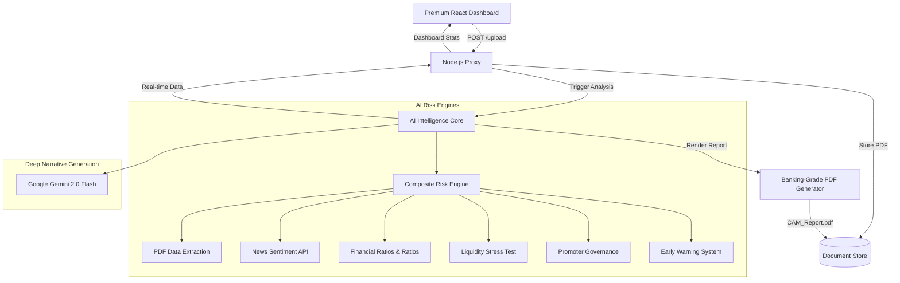

# 🏦 INTELLI-CREDIT

**The Future of Corporate Credit Appraisal: AI-Driven Intelligence & Deep Insights**

Intelli-Credit is a banking-grade Credit Appraisal Memo (CAM) engine that transforms raw financial PDFs into actionable intelligence. Combining a high-fidelity **Glassmorphism UI** with a multi-layered **Python AI Risk Core**, it automates the complex due diligence process for corporate lending.

---

## ✨ Premium Features

- **💎 Advanced Glassmorphism Dashboard**: A futuristic, high-performance UI with neon gradients, animated charts, and real-time analysis logs.
- **🧠 Multi-Layer AI Risk Core**:
  - **Financial Integrity**: Detects suspicious patterns in accounting data.
  - **Liquidity Resilience**: Stress-tests cash flows and leverage.
  - **Promoter Governance**: Appraises management quality and director profiles.
  - **EWS (Early Warning System)**: Predicts default probability using advanced scoring.
- **📰 Real-Time Sentiment Analysis**: Integrates with **NewsAPI** to scan for market sentiment and reputational risks.
- **🤖 Gemini-Powered Narrative**: AI-generated senior analyst notes providing deep reasoning for every credit decision.
- **📄 Professional CAM Memo**: Generates a 10-section, high-fidelity PDF report ready for banking committee review.

---

## 🏗️ Intelligence Architecture



---

## 🛠️ Tech Stack

### Frontend (Futuristic)
- **React 18** + **Vite**
- **Tailwind CSS** (Custom Neon Theme)
- **Lucide Icons** & **Recharts** (Interactive Analytics)
- **Glass-Ultra** Design System

### Backend (Orchestration)
- **Node.js** & **Express**
- **Multer** (Secure File Handling)
- **Axios** (Service Interconnect)

### AI Service (Intelligence)
- **Python / FastAPI**
- **Google Generative AI** (Gemini 2.0 Flash)
- **NewsAPI** & **Alpha Vantage**
- **pdfplumber** & **ReportLab** (High-Fidelity PDF)

---

## 🏃 Quick Start

### 1. Prerequisites
- Node.js (v18+)
- Python (v3.10+)
- Gemini API Key, NewsAPI Key, Alpha Vantage Key (Set in `.env`)

### 2. Launch AI Intelligence Core (Python)
```bash
cd ai-service
pip install -r requirements.txt
# Configure your .env with API keys
python main.py
```
*Service active on `http://localhost:8000`*

### 3. Launch Backend Proxy (Node.js)
```bash
cd backend
npm install
node server.js
```
*API active on `http://localhost:5000`*

### 4. Launch Futuristic Dashboard (React)
```bash
cd frontend
npm install
npm run dev
```
*Access at `http://localhost:5173`*

---

## 📅 Example Workflow
1. **Drop Sequence**: Drag and drop a financial PDF into the **Upload Nexus**.
2. **Analysis Stream**: Watch the holographic terminal logs as the 6 AI engines appraise the company.
3. **Verdict**: View the **Composite Risk Score** and deep AI narratives in the dashboard.
4. **CAM Export**: Download the **Elite CAM Report** for professional credit committees.

---
**Mission Status: MISSION ACCOMPLISHED 🏦📈💎🏁**
